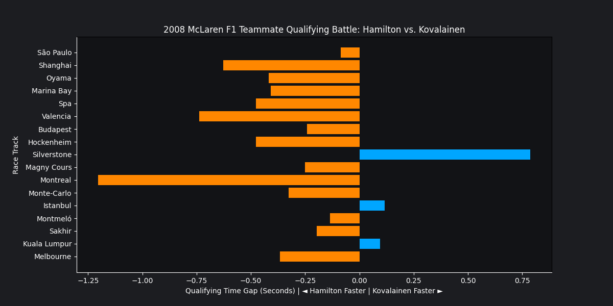

# 🏁 Hamilton vs Kovalainen Qualifying Battle (2008)

## Overview

This project analyzes the qualifying performance of Lewis Hamilton and Heikki Kovalainen during the 2008 Formula 1 season. Using Q3 qualifying session data, it highlights which McLaren driver was faster at each circuit and measures the performance gap between teammates.

## Visualization

## Drivers Analyzed

* Lewis Hamilton
* Heikki Kovalainen

## Technologies Used

* Python
* Pandas
* Matplotlib

## Key Features

* Multi-dataset integration
* Qualifying time conversion to seconds
* Q3 session performance comparison
* Teammate battle analysis
* Horizontal bar chart visualization

## Skills Demonstrated

* Data Cleaning
* Data Wrangling
* Sports Analytics
* Comparative Analysis
* Data Visualization

## Future Improvements

* Include Q1 and Q2 analysis
* Compare race pace alongside qualifying pace
- Analyze all McLaren teammate battles
- Build an interactive dashboard using Power BI
